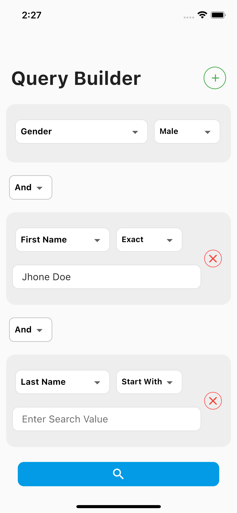

# Query Builder Task
Assume that you have a users Collection, the user collection contains the following fields:
● user_id
● first_name ● last_name ● full_name ● gender
● age

# Task Description:
 
● The user chooses the field he needs to search.
● Choose the operator (=, !=, >, <) in case of numbers and the operator (starts
with, ends with, contains, exact) in case of strings.
● Enter the value.
● Press Search.
● The user may add more queries and join them with (AND) (OR) Operators.
● The result will be displayed on a separate screen with a back button.
This project is a starting point for a Flutter application.

State Management : 
Bloc 
 